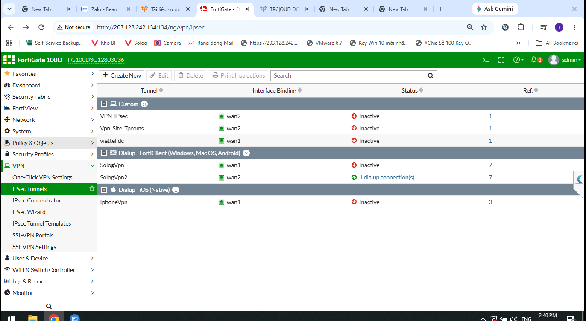
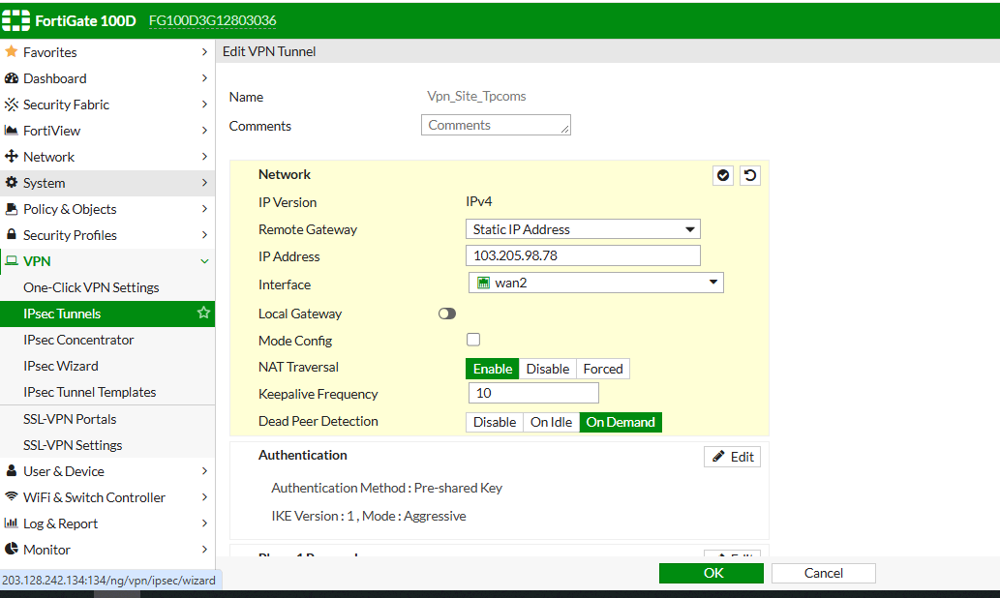
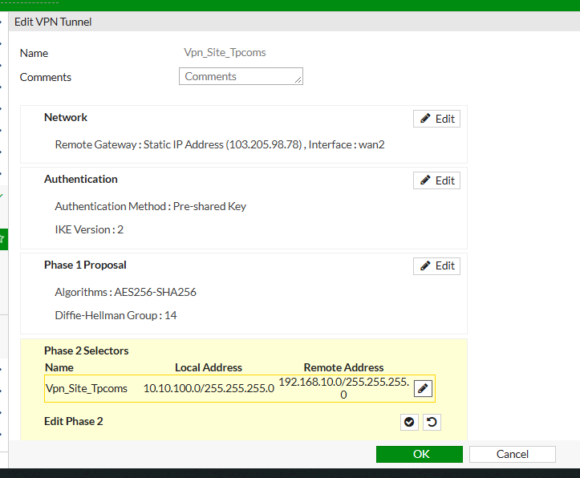
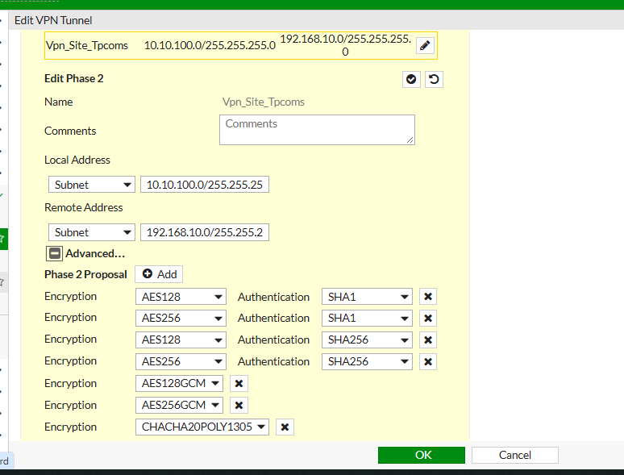
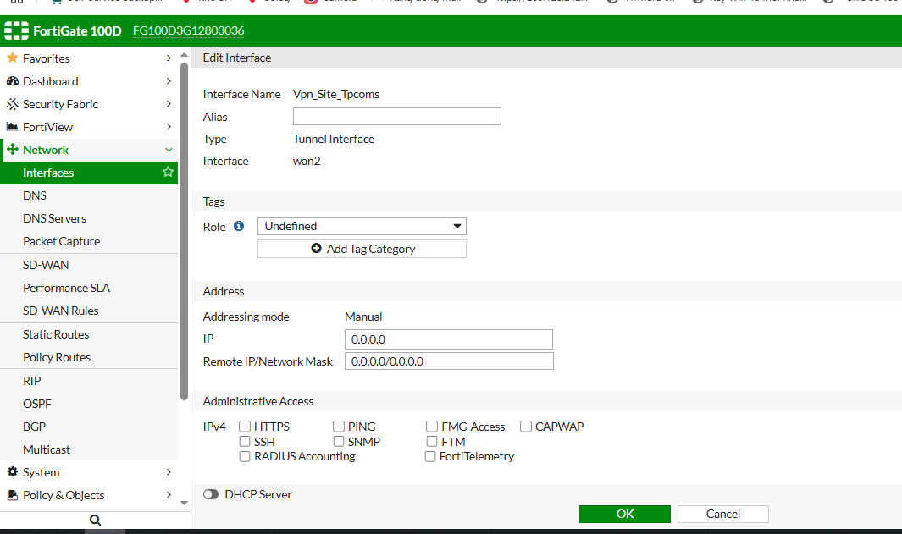
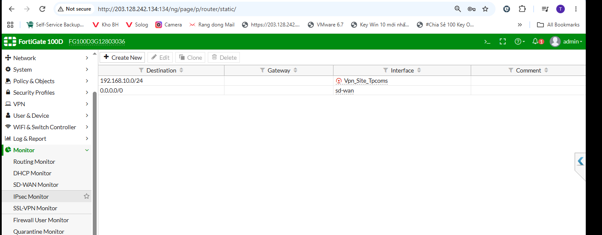
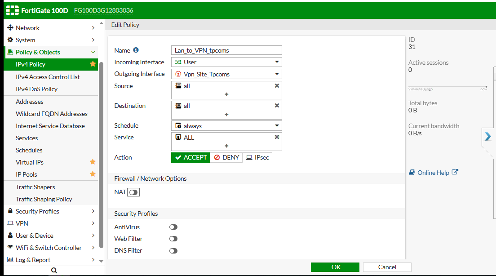

# FortiGate Route-Based Site-to-Site IPsec VPN

**Step-by-step GUI Runbook — FortiGate ↔ VCD / NSX Edge**

> Tài liệu này chuẩn hóa lại nội dung cấu hình Route-Based Site-to-Site IPsec VPN từ tài liệu gốc.  
> Các ảnh chụp là ảnh thực tế trong quá trình cấu hình; nếu ảnh hiển thị giá trị trung gian, **ưu tiên giá trị cuối cùng trong bảng cấu hình của từng bước**.

---

## 1. Thông tin cấu hình

| Hạng mục | Giá trị |
|---|---|
| Tunnel name | `Vpn_Site_Tpcoms` |
| WAN interface | `wan2` |
| Remote Gateway | `103.205.98.78` |
| Local LAN | `10.10.100.0/24` |
| Remote LAN | `192.168.10.0/24` |
| FortiGate VTI | `169.254.100.1` |
| VCD / NSX VTI | `169.254.100.2` |
| VTI subnet | `169.254.100.0/30` |

### 1.1. IPsec parameters

| Hạng mục | Giá trị |
|---|---|
| IKE version | `IKEv2` |
| Phase 1 | `AES256 / SHA256 / DH14` |
| Phase 1 Lifetime | `86400 seconds` |
| Phase 2 | `AES256 / SHA256` |
| PFS | `Enable` |
| Phase 2 DH Group | `14` |
| Phase 2 Lifetime | `43200 seconds` |
| VPN NAT | `Disable` |

> **IMPORTANT:** Pre-shared Key (PSK) phải giống hoàn toàn ở hai đầu. Không ghi PSK thật vào tài liệu dùng chung.

---

## 2. Kiến trúc kết nối

```text
10.10.100.0/24
       |
       v
+-----------------------------+
| FortiGate                   |
| Tunnel: Vpn_Site_Tpcoms     |
| VTI: 169.254.100.1          |
+-----------------------------+
       |
       | IKEv2 / IPsec
       |
+-----------------------------+
| VCD / NSX Edge              |
| VTI: 169.254.100.2          |
+-----------------------------+
       |
       v
192.168.10.0/24
```

---

## 3. Bước 1 — Mở hoặc tạo IPsec Tunnel

Vào:

`VPN → IPsec Tunnels`

- Nếu đã có tunnel `Vpn_Site_Tpcoms`: chọn **Edit**.
- Nếu triển khai mới: chọn **Create New** và tạo tunnel dạng **Custom / Interface Mode (route-based)**.



*Hình 1 — Danh sách IPsec Tunnel trên FortiGate.*

---

## 4. Bước 2 — Network / Remote Gateway

Cấu hình các giá trị sau:

| Tham số | Giá trị |
|---|---|
| Remote Gateway | `Static IP Address` |
| IP Address | `103.205.98.78` |
| Interface | `wan2` |
| Local Gateway | `Disable` |
| Mode Config | `Disable` |
| NAT Traversal | `Enable` |
| DPD | `On Demand` |

> **CHECK:** `wan2` chỉ là underlay để IKE/IPsec đi ra Internet. Traffic LAN-to-LAN sẽ được route qua interface `Vpn_Site_Tpcoms`.



*Hình 2 — Network / Remote Gateway.*

---

## 5. Bước 3 — Authentication và Phase 1

### 5.1. Authentication

| Tham số | Giá trị |
|---|---|
| Method | `Pre-shared Key` |
| PSK | Giống phía VCD / NSX Edge |
| IKE Version | `2` |
| Peer ID | `Any peer ID` trong lab |

### 5.2. Phase 1 Proposal

| Tham số | Giá trị |
|---|---|
| Encryption | `AES256` |
| Authentication | `SHA256` |
| DH Group | `14` |
| Lifetime | `86400 seconds` |
| Local ID | Để trống nếu peer không yêu cầu |

> **NOTE:** Chỉ giữ một proposal `AES256-SHA256` để quá trình troubleshooting đơn giản và rõ ràng hơn.



*Hình 3 — Summary sau khi chuyển sang IKEv2.*

---

## 6. Bước 4 — Phase 2 Selector và Proposal

### 6.1. Phase 2 Selector

| Tham số | Giá trị |
|---|---|
| Local Address | `10.10.100.0/24` |
| Remote Address | `192.168.10.0/24` |
| Encryption | `AES256` |
| Authentication | `SHA256` |

### 6.2. Advanced

| Tham số | Giá trị |
|---|---|
| Replay Detection | `Enable` |
| PFS | `Enable` |
| DH Group | Chỉ giữ `14` |
| Local Port | `All` |
| Remote Port | `All` |
| Protocol | `All` |
| Auto-negotiate | `Disable` hoặc theo yêu cầu vận hành |
| Lifetime | `43200 seconds` |

> **IMPORTANT:** Nếu VCD / NSX sử dụng Phase 2 selector `0.0.0.0/0`, selector phải được đồng bộ chính xác giữa hai đầu.



*Hình 4 — Phase 2 Selector / Proposal.*

---

## 7. Bước 5 — Gán IP cho VTI / Tunnel Interface

Vào:

`Network → Interfaces → Vpn_Site_Tpcoms → Edit`

Cấu hình:

| Tham số | Giá trị |
|---|---|
| Addressing mode | `Manual` |
| IP | `169.254.100.1` |
| Remote IP / Mask | `169.254.100.2 / 255.255.255.252` |
| PING | Có thể `Enable` để test VTI |
| HTTPS / SSH / SNMP | Không bật nếu không cần |

> **CHECK:** Mô hình Route-Based phía VCD sử dụng VTI `169.254.100.0/30`: FortiGate là `.1`, VCD / NSX Edge là `.2`.



*Hình 5 — Vị trí cấu hình IP và Remote IP / Network Mask cho VTI.*

---

## 8. Bước 6 — Static Route tới Remote LAN

Vào:

`Network → Static Routes → Create New`

Cấu hình:

| Tham số | Giá trị |
|---|---|
| Destination | `192.168.10.0/24` |
| Interface | `Vpn_Site_Tpcoms` |
| Gateway | Có thể để trống như lab |
| Explicit next-hop | Hoặc sử dụng `169.254.100.2` |
| Distance | `10` hoặc theo chuẩn hệ thống |

> **NOTE:** Nếu sử dụng next-hop VTI, route sẽ thể hiện rõ đường đi: `192.168.10.0/24 → 169.254.100.2 → Vpn_Site_Tpcoms`.



*Hình 6 — Static route tới `192.168.10.0/24`.*

---

## 9. Bước 7 — Firewall Policy hai chiều

### 9.1. LAN → VPN

| Tham số | Giá trị |
|---|---|
| Incoming Interface | `User` |
| Outgoing Interface | `Vpn_Site_Tpcoms` |
| Source | `10.10.100.0/24` |
| Destination | `192.168.10.0/24` |
| Action | `ACCEPT` |
| Service | `ALL` trong lab |
| NAT | `Disable` |

### 9.2. VPN → LAN

| Tham số | Giá trị |
|---|---|
| Incoming Interface | `Vpn_Site_Tpcoms` |
| Outgoing Interface | `User` |
| Source | `192.168.10.0/24` |
| Destination | `10.10.100.0/24` |
| Action | `ACCEPT` |
| NAT | `Disable` |

> **IMPORTANT:** Ảnh lab đang sử dụng `Source/Destination = all`. Khi triển khai production nên dùng address object đúng subnet và giới hạn service theo nhu cầu thực tế.



*Hình 7 — Policy LAN-to-VPN, NAT OFF.*

---

## 10. Bước 8 — Map cấu hình sang VCD / NSX Edge

### 10.1. Thông số VPN phía VCD / NSX

| Tham số | Giá trị |
|---|---|
| VPN Type | `Route-Based` |
| IKE | `IKEv2` |
| Phase 1 | `AES256 / SHA256 / DH14 / 86400` |
| Phase 2 | `AES256 / SHA256 / PFS DH14 / 43200` |
| VCD VTI | `169.254.100.2/30` |
| Peer VTI | `169.254.100.1` |

### 10.2. Routing phía VCD / NSX

| Tham số | Giá trị |
|---|---|
| Destination | `10.10.100.0/24` |
| Next-hop | `169.254.100.1` |
| Return route phía FortiGate | `192.168.10.0/24` qua VPN |

> **CHECK:** Kiểm tra Gateway Firewall / policy phía VCD cho phép traffic `192.168.10.0/24 ↔ 10.10.100.0/24`.

> **IMPORTANT:** Nếu VCD / NSX yêu cầu khác về Phase 2 selector hoặc lifetime, ưu tiên đồng bộ chính xác hai đầu trước khi troubleshooting routing.

---

## 11. Kiểm tra và Troubleshooting

### 11.1. Kiểm tra GUI

Vào:

`VPN → IPsec Monitor`

Kiểm tra trạng thái của tunnel `Vpn_Site_Tpcoms`.

### 11.2. Kiểm tra CLI

```shell
get vpn ipsec tunnel summary
```

Kiểm tra tổng quan trạng thái các IPsec tunnel.

```shell
diagnose vpn tunnel list name Vpn_Site_Tpcoms
```

Kiểm tra chi tiết Phase 2 / SA của tunnel `Vpn_Site_Tpcoms`.

```shell
diagnose vpn ike gateway list
```

Kiểm tra IKE gateway / Phase 1.

```shell
get router info routing-table details 192.168.10.1
```

Kiểm tra route FortiGate đang sử dụng để đi tới một IP thuộc Remote LAN.

### 11.3. Test VTI

```shell
execute ping-options source 169.254.100.1
execute ping 169.254.100.2
execute ping-options reset
```

Mục đích:

1. Set source ping là VTI của FortiGate `169.254.100.1`.
2. Ping VTI phía VCD / NSX Edge `169.254.100.2`.
3. Reset ping options sau khi test.

### 11.4. Thứ tự troubleshooting khuyến nghị

1. IKE / Phase 1.
2. Phase 2 proposal và selector.
3. VTI IP.
4. Static route.
5. Firewall policy.
6. Xác nhận NAT đang `Disable`.
7. Route và firewall phía VCD / NSX.
8. Sniffer / debug flow nếu cần.

> **CHECK:** Nếu VTI ping được nhưng LAN-to-LAN không thông, ưu tiên kiểm tra route, firewall policy và return path.

---

## 12. Checklist bàn giao

- [ ] IKE sử dụng `IKEv2`.
- [ ] Phase 1: `AES256-SHA256 / DH14 / 86400`.
- [ ] Phase 2: `AES256-SHA256 / PFS DH14 / 43200`.
- [ ] FortiGate VTI: `169.254.100.1`.
- [ ] VCD / NSX VTI: `169.254.100.2/30`.
- [ ] FortiGate có route `192.168.10.0/24 → VPN`.
- [ ] VCD / NSX có route `10.10.100.0/24 → 169.254.100.1`.
- [ ] Firewall policy hai chiều `ACCEPT`, NAT `OFF`.
- [ ] VTI `169.254.100.1 ↔ 169.254.100.2` ping được.
- [ ] LAN-to-LAN thông theo policy đã định nghĩa.

> **NOTE — Production:** Dùng address object cụ thể, giới hạn service, bật logging phù hợp, sử dụng PSK mạnh hoặc certificate nếu có, và cân nhắc blackhole route với distance cao để tránh traffic tới Remote LAN rơi ra default route khi tunnel down.

---

## 13. Tóm tắt cấu hình cuối cùng

| Thành phần | FortiGate | VCD / NSX Edge |
|---|---|---|
| Public / Peer | `wan2` → `103.205.98.78` | Peer FortiGate |
| IKE | `IKEv2` | `IKEv2` |
| Phase 1 | `AES256 / SHA256 / DH14 / 86400` | Phải đồng bộ |
| Phase 2 | `AES256 / SHA256 / PFS DH14 / 43200` | Phải đồng bộ |
| VTI | `169.254.100.1` | `169.254.100.2/30` |
| Local subnet | `10.10.100.0/24` | `192.168.10.0/24` |
| Remote subnet | `192.168.10.0/24` | `10.10.100.0/24` |
| VPN NAT | `Disable` | Theo policy tương ứng |
| Route | `192.168.10.0/24 → Vpn_Site_Tpcoms` | `10.10.100.0/24 → 169.254.100.1` |

