# Hướng dẫn cấu hình Palo Alto

> Tài liệu LAB/POC triển khai Palo Alto VM-Series trên VMware Cloud Director (VCD), sử dụng PAN-OS 12.1.9.  
> Phạm vi tài liệu bắt đầu từ bước VM Palo Alto đã được tạo trên VCD; không bao gồm upload OVA/Catalog hoặc wizard tạo vApp từ template.

## Mục lục

- [1. Mục tiêu và phạm vi](#1-mục-tiêu-và-phạm-vi)
- [2. Kiến trúc LAB](#2-kiến-trúc-lab)
- [3. Đề xuất tài nguyên VM](#3-đề-xuất-tài-nguyên-vm)
- [4. Quy hoạch network](#4-quy-hoạch-network)
- [5. Mapping NIC giữa VCD và PAN-OS](#5-mapping-nic-giữa-vcd-và-pan-os)
- [6. Cấu hình Management Interface](#6-cấu-hình-management-interface)
- [7. Tạo Security Zone](#7-tạo-security-zone)
- [8. Cấu hình Data Interface](#8-cấu-hình-data-interface)
- [9. Interface Management Profile](#9-interface-management-profile)
- [10. Virtual Router và Default Route](#10-virtual-router-và-default-route)
- [11. Security Policy cho LAN đi Internet](#11-security-policy-cho-lan-đi-internet)
- [12. Source NAT cho LAN đi Internet](#12-source-nat-cho-lan-đi-internet)
- [13. Publish RDP bằng Destination NAT](#13-publish-rdp-bằng-destination-nat)
- [14. Commit và kiểm tra](#14-commit-và-kiểm-tra)

---

## 1. Mục tiêu và phạm vi

Mục tiêu của LAB là sử dụng Palo Alto VM-Series làm Layer 3 firewall/gateway cho workload nằm trong một VCD Isolated Network.

Các chức năng được cấu hình trong tài liệu:

- Management riêng qua interface `MGT`.
- `ethernet1/1` làm WAN/UNTRUST.
- `ethernet1/2` làm LAN/TRUST và default gateway cho workload.
- Static default route ra upstream WAN gateway.
- Security Policy từ TRUST ra UNTRUST.
- Source NAT cho workload đi Internet.
- Destination NAT để publish RDP vào một VM nội bộ.
- Kiểm tra routing, ARP, session và connectivity.
- Troubleshooting NIC/MAC mapping trên VMware/VCD.

**Environment sử dụng trong tài liệu:**

| Thành phần | Giá trị |
|---|---|
| Firewall | Palo Alto VM-Series |
| PAN-OS | 12.1.9 |
| Hypervisor/Cloud | VMware vSphere / VMware Cloud Director |
| Interface mode | Layer 3 |
| Virtual Router | `default` |
| LAN test VM | Windows Server / Bastion |

---

## 2. Kiến trúc LAB

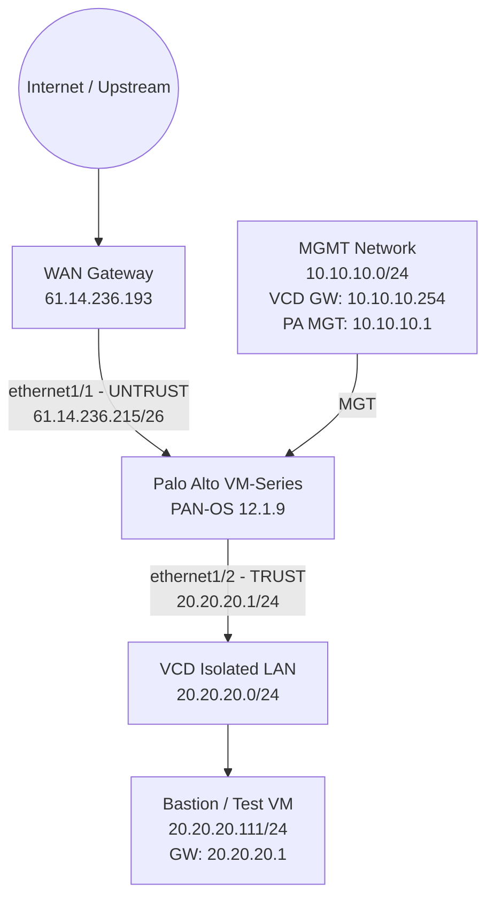

Luồng outbound:

```text
20.20.20.111
    |
    | Default Gateway: 20.20.20.1
    v
PA ethernet1/2 (TRUST)
    |
    | Security Policy + Source NAT
    v
PA ethernet1/1 (UNTRUST) - 61.14.236.215
    |
    v
61.14.236.193
    |
    v
Internet
```

---

## 3. Đề xuất tài nguyên VM

Cấu hình dưới đây phù hợp cho LAB/POC nhỏ, không phải sizing production:

| Resource | Khuyến nghị LAB |
|---|---:|
| vCPU | 2 vCPU |
| RAM | 8 GB |
| System Disk | 60 GB |
| vNIC | 3 x VMXNET3 |

> **Lưu ý:** Sizing production phải dựa trên VM-Series model/license, throughput, session count, Security Profiles và các feature được bật. Palo Alto quy định minimum resource khác nhau theo từng VM-Series model.

---

## 4. Quy hoạch network

| Network | Subnet | Palo Alto IP | Gateway | Mục đích |
|---|---|---|---|---|
| MGMT | `10.10.10.0/24` | `10.10.10.1` | `10.10.10.254` | WebGUI, SSH, DNS/NTP, license/update |
| WAN | `61.14.236.192/26` | `61.14.236.215/26` | `61.14.236.193` | Upstream / Internet |
| LAN | `20.20.20.0/24` | `20.20.20.1/24` | Palo Alto chính là gateway | Workload internal |

VM dùng để test:

```text
IP Address : 20.20.20.111/24
Gateway    : 20.20.20.1
DNS        : 8.8.8.8
```

### Vai trò của MGMT Network

MGMT Network chỉ dành cho **management plane**, không dùng để forward traffic của workload.

Trong LAB này MGMT Network có gateway `10.10.10.254`, do đó firewall có thể sử dụng management interface cho:

- WebGUI / SSH.
- License activation.
- DNS / NTP.
- Dynamic Updates.
- Kết nối Panorama nếu triển khai sau này.

Nếu MGMT Network là isolated hoàn toàn thì cần một Jump/Bastion host cùng network để truy cập firewall.

---

## 5. Mapping NIC giữa VCD và PAN-OS

Đây là phần quan trọng nhất khi triển khai VM-Series trên VMware/VCD.

### 5.1 Mapping sử dụng trong LAB

| VCD NIC | Network trên VCD | IP | Interface PAN-OS | Zone |
|---|---|---|---|---|
| NIC 0 | `PA_MGT_10.10.10.0/24` | `10.10.10.1` | Management (MGT) | N/A |
| NIC 1 | WAN Network | `61.14.236.215` | `ethernet1/1` | UNTRUST |
| NIC 2 | `PA_LAN_20.20.20.0/24` | `20.20.20.1` | `ethernet1/2` | TRUST |

> **Quan trọng:** VCD hiển thị NIC theo index `0, 1, 2`, trong khi tài liệu VMware/Palo Alto thường gọi adapter đầu tiên là vNIC/Network Adapter `1`. Vì vậy:
>
> - VCD `NIC 0` = VMware adapter đầu tiên = Palo Alto Management.
> - VCD `NIC 1` = VMware adapter thứ hai = `ethernet1/1`.
> - VCD `NIC 2` = VMware adapter thứ ba = `ethernet1/2`.

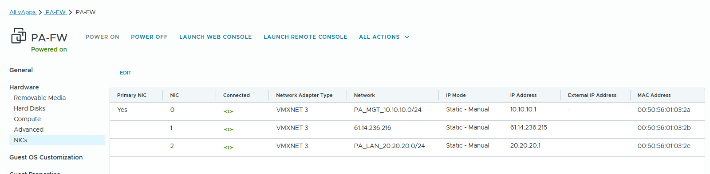

Không nên remove/reorder NIC sau khi firewall đã được cấu hình nếu không có kế hoạch kiểm tra lại interface mapping và MAC address.

---

## 6. Cấu hình Management Interface

Management interface trong LAB:

```text
IP      : 10.10.10.1
Netmask : 255.255.255.0
Gateway : 10.10.10.254
```

Nếu cần cấu hình bằng CLI từ console:

```bash
configure
set deviceconfig system type static
set deviceconfig system ip-address 10.10.10.1 netmask 255.255.255.0 default-gateway 10.10.10.254
set deviceconfig system dns-setting servers primary 8.8.8.8
commit
exit
```

Kiểm tra:

```bash
show interface management
```

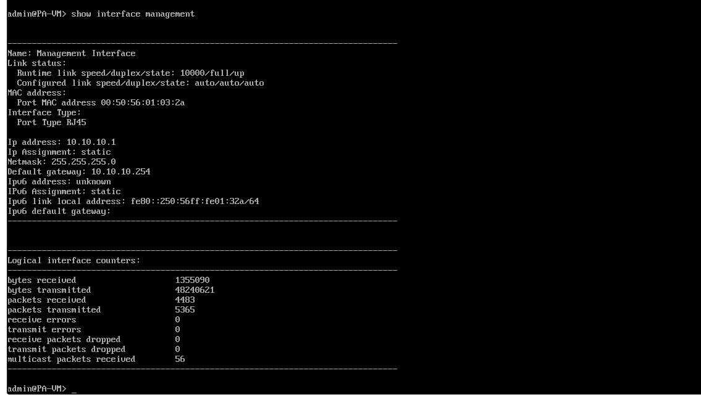

Sau khi Management IP hoạt động, truy cập:

```text
https://10.10.10.1
```

Với image sạch, credential mặc định ban đầu là `admin/admin`; cần đổi password ngay khi đăng nhập lần đầu.

---

## 7. Tạo Security Zone

Vào:

```text
Network > Zones
```

Tạo hai zone Layer 3:

| Zone | Type | Interface |
|---|---|---|
| `UNTRUST` | Layer3 | `ethernet1/1` |
| `TRUST` | Layer3 | `ethernet1/2` |

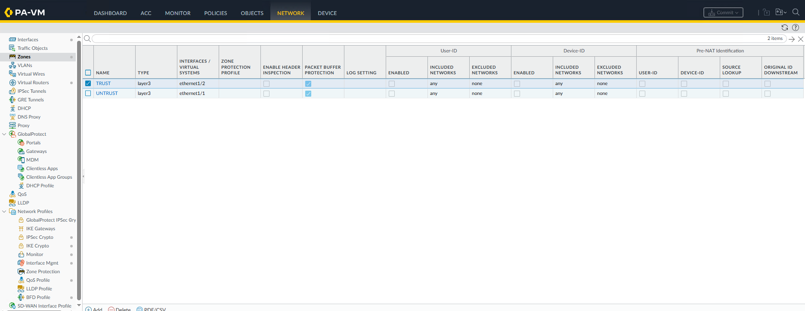

---

## 8. Cấu hình Data Interface

Vào:

```text
Network > Interfaces > Ethernet
```

### 8.1 WAN - ethernet1/1

Cấu hình:

```text
Interface Type : Layer3
Virtual Router : default
Security Zone  : UNTRUST
IPv4 Address   : 61.14.236.215/26
```

### 8.2 LAN - ethernet1/2

Cấu hình:

```text
Interface Type      : Layer3
Virtual Router      : default
Security Zone       : TRUST
IPv4 Address        : 20.20.20.1/24
Management Profile  : allow-ping
```

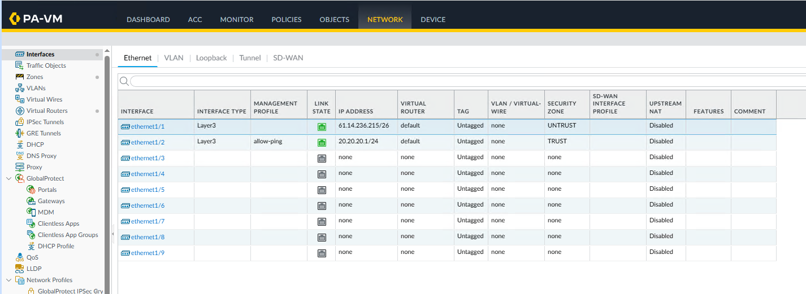

Kiểm tra bằng CLI:

```bash
show interface all
```

Kết quả mong đợi:

```text
ethernet1/1   up   61.14.236.215/26   UNTRUST
ethernet1/2   up   20.20.20.1/24      TRUST
```

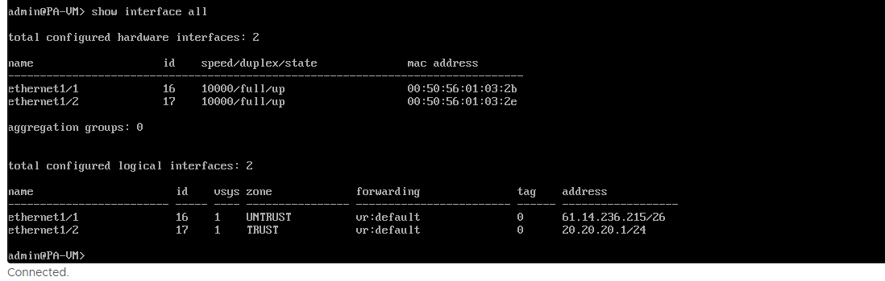

---

## 9. Interface Management Profile

Mặc định, data interface không tự động trả lời Ping/SSH/HTTPS. Nếu muốn test ping tới `20.20.20.1`, cần gắn Interface Management Profile.

Vào:

```text
Network > Network Profiles > Interface Mgmt
```

Tạo profile ví dụ:

```text
Name : allow-ping
Ping : Enabled
```

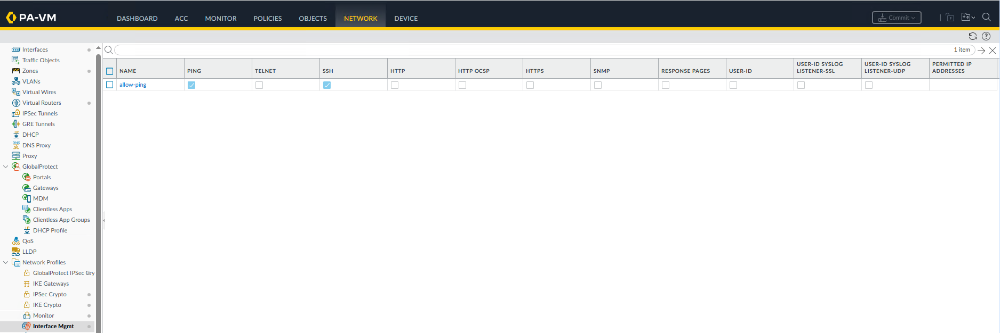

Sau đó gắn profile vào `ethernet1/2`.

> **Security note:** Screenshot LAB có thể hiển thị thêm SSH được enable. Trong production, chỉ enable đúng service thật sự cần thiết và giới hạn `Permitted IP Addresses`. Với mục đích kiểm tra connectivity, chỉ cần `Ping`.

---

## 10. Virtual Router và Default Route

### 10.1 Virtual Router

Vào:

```text
Network > Virtual Routers > default
```

Đảm bảo cả hai data interface nằm trong Virtual Router `default`:

```text
ethernet1/1
ethernet1/2
```

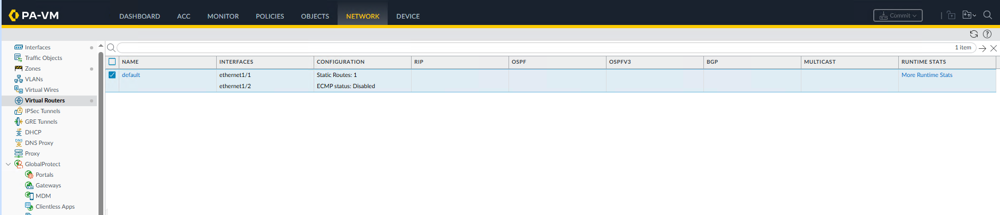

### 10.2 Default Route

Vào:

```text
Network > Virtual Routers > default > Static Routes
```

Tạo route:

```text
Name        : default-route
Destination : 0.0.0.0/0
Interface   : ethernet1/1
Next Hop    : 61.14.236.193
Metric      : 10
```

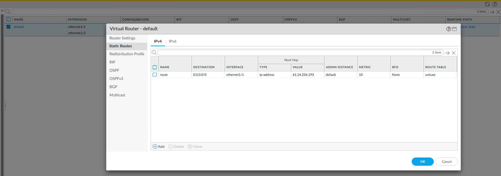

Kiểm tra routing table:

```bash
show routing route
```

Kỳ vọng có các route chính:

```text
0.0.0.0/0          -> 61.14.236.193 -> ethernet1/1
61.14.236.192/26    -> connected     -> ethernet1/1
20.20.20.0/24       -> connected     -> ethernet1/2
```

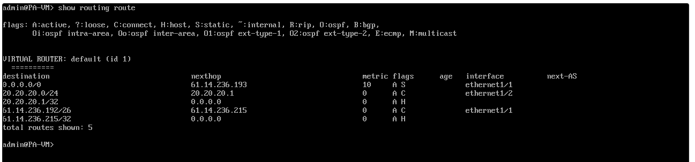

---

## 11. Security Policy cho LAN đi Internet

Vào:

```text
Policies > Security
```

Tạo một rule outbound sạch, ví dụ:

```text
Name             : LAN-TO-INTERNET
Source Zone      : TRUST
Source Address   : 20.20.20.0/24
Destination Zone : UNTRUST
Destination      : any
Application      : any
Service          : application-default
Action           : Allow
```

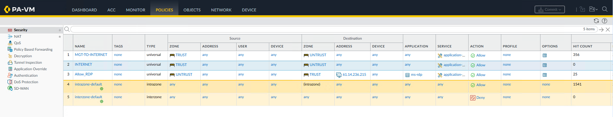

> Screenshot LAB có một số rule được tạo trong quá trình test. Khi chuẩn hóa production, nên xóa/disable rule duplicate và chỉ giữ rule có mục đích rõ ràng.

Khuyến nghị production:

- Dùng address object thay vì nhập subnet trực tiếp nếu cần quản trị dài hạn.
- Thu hẹp Application/Service theo nhu cầu thực tế.
- Gắn Security Profiles phù hợp (Antivirus, Anti-Spyware, Vulnerability, URL Filtering...).
- Enable log at session end và log forwarding nếu có SIEM/Syslog.

---

## 12. Source NAT cho LAN đi Internet

Vào:

```text
Policies > NAT
```

Tạo rule:

```text
Name : LAN-TO-WAN
```

### Original Packet

```text
Source Zone           : TRUST
Destination Zone      : UNTRUST
Destination Interface : any
Source Address        : 20.20.20.0/24
Destination Address   : any
Service               : any
```

### Translated Packet

```text
Source Address Translation
  Translation Type : Dynamic IP And Port
  Address Type     : Interface Address
  Interface        : ethernet1/1

Destination Address Translation
  Translation Type : None
```

Kết quả:

```text
20.20.20.111
     |
     | Source NAT
     v
61.14.236.215
```

Rule thực tế trong LAB được hiển thị ở screenshot dưới:

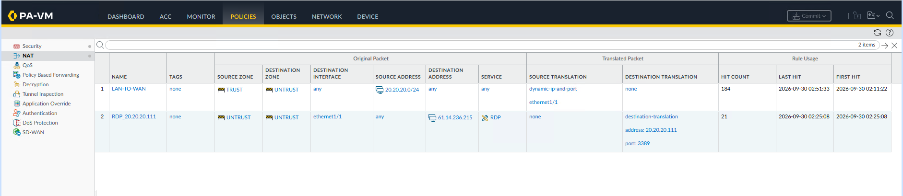

---

## 13. Publish RDP bằng Destination NAT

Ví dụ publish RDP từ WAN IP `61.14.236.215:3389` vào VM `20.20.20.111:3389`.

### 13.1 Service Object

Tạo service nếu chưa có:

```text
Objects > Services

Name             : RDP
Protocol         : TCP
Destination Port : 3389
```

### 13.2 DNAT Rule

```text
Policies > NAT
```

Tạo:

```text
Name : RDP_20.20.20.111
```

Original Packet:

```text
Source Zone           : UNTRUST
Destination Zone      : UNTRUST
Destination Interface : ethernet1/1
Source Address        : any
Destination Address   : 61.14.236.215
Service               : RDP
```

Translated Packet:

```text
Source Translation : None

Destination Address Translation
  Translated Address : 20.20.20.111
  Translated Port    : 3389
```

### 13.3 Security Policy cho RDP

Tạo Security Rule:

```text
Name                : Allow_RDP
Source Zone         : UNTRUST
Destination Zone    : TRUST
Source Address      : <Public-IP-quản-trị>
Destination Address : 61.14.236.215
Application         : ms-rdp
Service             : application-default
Action              : Allow
```

> Palo Alto Security Policy sử dụng **pre-NAT address** nhưng **post-NAT destination zone**. Vì vậy Destination Address vẫn là `61.14.236.215`, còn Destination Zone là `TRUST`.

> **Không nên** để Source Address là `any` khi expose RDP ra Internet. Nên giới hạn đúng public IP/VPN/jump-host quản trị.

Các rule Source NAT và RDP DNAT trong LAB:


Security rule RDP:


---

## 14. Commit và kiểm tra

Sau mỗi nhóm thay đổi:

```text
Commit > Commit
```

Hoặc CLI:

```bash
configure
commit
exit
```

> Nếu đang ở Operational mode (`admin@PA-VM>`), gõ trực tiếp `commit` sẽ báo unknown command. `commit` chỉ chạy trong Configuration mode hoặc từ WebGUI.

### 14.1 Kiểm tra Management

```bash
show interface management
```

### 14.2 Kiểm tra Data Interface

```bash
show interface all
```

Cần thấy `ethernet1/1` và `ethernet1/2` ở trạng thái `up`.

### 14.3 Kiểm tra route

```bash
show routing route
```

### 14.4 Kiểm tra ARP

```bash
show arp all
```

Kỳ vọng firewall học được ít nhất:

```text
61.14.236.193   -> WAN gateway MAC  -> ethernet1/1
20.20.20.111    -> VM MAC           -> ethernet1/2
```

### 14.5 Test WAN từ Palo Alto

Trên PAN-OS 12.1 trong LAB này, sử dụng `logical-router`:

```bash
ping source 61.14.236.215 host 61.14.236.193 logical-router any
ping source 61.14.236.215 host 8.8.8.8 logical-router any
```

### 14.6 Test từ LAN VM

Trên Windows:

```cmd
ipconfig /all
ping 20.20.20.1
ping 8.8.8.8
ping google.com
```

Kết quả LAB đã truy cập Internet thành công:

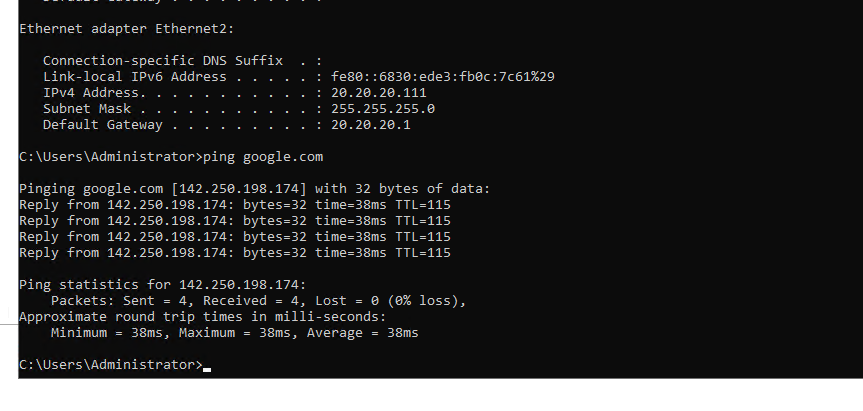

### 14.7 Kiểm tra session

```bash
show session all filter source 20.20.20.111
```


## Ghi chú

Các IP trong tài liệu phản ánh đúng LAB được sử dụng khi xây dựng hướng dẫn. Nếu đưa repository ra public, cần xác nhận các public IP có được phép công khai hay không và nên thay bằng địa chỉ documentation/example nếu cần.
